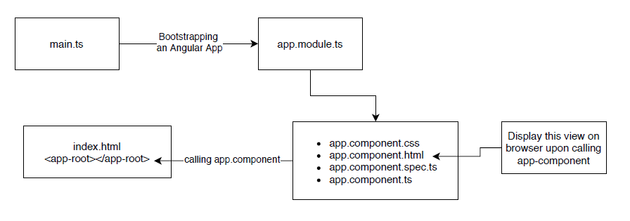

# Getting started with Angular

------

## Table of Contents  
* [Single Page Application](#Single-Page-Application)<br>
* [Prerequisites to Start the Angular Development in Windows](#Prerequisites-to-Start-the-Angular-Development-in-Windows)<br>
* [Some Important Files in the Angular Project](#Some-Important-Files-in-The-Angular-Project)<br>
* [Bootstrap Usage in Angular Project](#Bootstrap-Usage-in-Angular-Project)<br>
* [Angular App Workflow](#Angular-App-Workflow)<br>
* [Components](#Components)<br>
* [Create a Component](#Create-a-Component)<br>
* [Using the Created Component](#Using-the-Created-Component)<br>
* [Adding HTML View into The Above Created Component](#Adding-HTML-View into-The-Above-Created-Component)<br>
* [Add Style to The Component](#Add-Style-to-The-Component)<br>
* [Databinding ](#Databinding )<br>
* [Introduction to Directives](#Introduction-to-Directives)<br>
* [Structural Directives](#Structural-Directives)<br>
* [Attribute Directives](#Attribute-Directives)<br>

## Single Page Application

1. A Web application which interact with the web browser by using only single page
2. The single page loaded dynamically with different data from server on the demand
3. No concept of loading different pages
4. Eg. Gmail, Facebook etc

## Prerequisites to Start the Angular Development in Windows

1. Installation of node,  Link:  [Node.js](https://nodejs.org/en/)

   ~~~powershell
   # Version check for Node.js 
   $ node -v
   ~~~

2. Installation of NPM [NPM is distributed with Node.js already]

   ~~~powershell
   # npm version check
   $ npm -v
   ~~~

3. Installation of Angular CLI tool

   ~~~powershell
   # install the angular cli
   $ npm install -g @angular/cli
   
   # create a new dummy project to check the installation
   $ ng new my-dream-app
   > Routing : no
   > default style sheet :  CSS
   
   # change the directory to the above created project
   $ cd my-dream-app
   
   # serve the above created app and open the local host port: 4200[default by angular
   $ ng serve
   
   # if on local host if you can see the angular app then whole installation process is successful
   ~~~

4. New Project without pre installed dependency

   ~~~powershell
   # If section 3 method takes too long, then follow this method
   # in this method we basically creates the angular app without pre imported dependency
   # and once project is created, we import the dependency manually
   
   # create new Angular project without dependecny
   $ ng new <projectName> --skip-install = true
   
   # install the dependency once project is created
   $ cd <projectName>
   $ npm install
   ~~~

## Some Important Files in The Angular Project

~~~typescript
 Angular-Project
    ├── e2e                    # end to end test
    ├── Node_modules           # dependency 
    ├── src                    # application logic related stuff resides here
    │   ├── app
    │   │   ├── app.component.ts    # this component will be loaded in index
    │   │   ├── app.component.html  
    │   │   ├── app.component.spec.ts
    │   │   ├── app.module.ts
    │   │   └── business-component  # user designed component
    │   │       ├── business-component.ts  # logic of the component
    │   │       ├── business-component.html # view of the component
    │   │       ├── business-component.css  # style of the component
    │   │       └── business-comoponent.spec.ts  # test of the component
    │   ├── assets  [folder]
    │   ├── environment [folder]  # environment variable dev / prod
    │   ├── browserslist          # list of all the supported browser
    │   ├── favicon.ico           # icon which is display on the browser tab
    │   ├── index.html            # angular loads this index page
    │   └── style.css             # application wide style applies here
    ├── angular.json            # Angular workspace configuration
    └── package.json            # project dependency + project property
~~~

## Bootstrap Usage in Angular Project

1. Install bootstrap in the project repository [project wide dependency]

   ~~~powershell
   $ npm install --save bootstrap@3
   ~~~

2. Update ```angular.json``` of the project

   ~~~typescript
   "projects": {
       "my-first-app": {
            "architect": {
                	"build": {
         				"styles": [
             					"node_modules/bootstrap/dist/css/bootstrap.min.css",
             					"src/styles.css"
         						]
    				}
            }
      }
   }
   ~~~

3. Restart the server using ```ng serve```

## Angular App Workflow



## Components

1. Components are atomic member of any angular app
2. Imagine an entire angular app consisting of multiple components
3. This components can be nested or interconnected or completely independent entity
4. Component can be interdependent through common services
5. each component contains html, css, ts and spec.ts files

## Create a Component

1. using Angular CLI

   ~~~powershell
   #inside project repository
   $ ng generate component <custom-component>
   
   # or acronyms can be used
   $ ng g c <custom-component>
   ~~~

2. Manually creating component

   ~~~typescript
   // create a folder <custom-component> in app folder of src
   
   // create atleast 3 files
   <custom-component>.component.ts
   <custom-component>.component.html
   <custom-component>.component.css
   
   // add content into component.ts file of this newly created component
   import { Component} from '@angular/core';
   
   @Component({
     selector: 'app-custom',	// use for calling this component in parent component
     templateUrl: './<custom-component>.component.html',
     styleUrls: ['./<custom-component>.component.css']
   })
   export class CustomComponent  { 
   }
   ~~~

3. Registering previously created component in ```app.module.ts```

   ~~~typescript
   // inside app.module.ts
   // import the component using its class name 
   import { CustomComponent } from './<custom-component.component>';
   
   @NgModule({
       declaration: [
           CustomComponent
       ]
   })
   ~~~

## Using the Created Component

1. ```App-component``` is the default component [root-component]

2. Other custom components are render inside it 

3. ```app-component``` is actually get render inside main ```index.html```

4. Here we will render ```custom-component``` inside ```app-component```

5. Following way you can render the ```custom-component``` inside ```app-component.html```

   ~~~html
   <!--app.component.html-->
   <app-custom>
   <!--rendering the component using its selector-->
   </app-custom>
   ~~~

6. Above method can be used to render child component inside parent component

7. Analogy: child component : ```custom-component``` , parent component : ```app-component```

## Adding HTML View into The Above Created Component

1. Connect the html file to the typescript file of the same component

   ~~~typescript
   // custom.component.ts
   @Component({
       templateUrl : 'path to custom-component.html'
   })
   ~~~

2. It is possible to add HTML code in typescript file directly 

   ~~~typescript
   @Component({
       template: 'HTML code will come here'
   })
   ~~~

3. HTML code in typescript file is only recommended when HTML code is relatively small

## Add Style to The Component

1. The CSS style can be added to the corresponding CSS file of the component

   ~~~typescript
   @Component({
     styleUrls: ['path to custom.component.css']
   })
   ~~~

## Databinding 

1. Data transfer between HTML layout and typescript file of the component

2. Can also be understand this concept as a communication between html and typescript file of the component

3. Type of Databinding, INPUT databinding and OUTPUT databinding

   | TYPES OF DATABINDING | DATA FLOW                       |
   | -------------------- | ------------------------------- |
   | Input databinding    | ```HTML  -----data----->  TS``` |
   | Output databinding   | ``` HTML <-----data----- TS```  |
   | Two way databinding  | ``` HTML <-----data-----> TS``` |

4. **String Interpolation**

   1. It is an Output databinding

   2. String interpolation used when you want to transfer data from TS to HTML of the component

   3. Eg. transferring variable value from TS to HTML of the component

   4. String interpolation is done by using ```{{property name from typescript}}```

   5. Using string interpolation we can access property as well as method of TS file in HTML

      ~~~typescript
      // string.component.ts
      import { Component } from '@angular/core';
      
      @Component({
        selector: 'app-string',
        templateUrl: './string.component.html',
        styleUrls: ['./string.component.css']
      })
      export class StringComponent {
            serverId : number = 2;
        	  private serverStatus : string = 'online';
          
            getServersStatus(){
            			let returnString = 'from string ' + this.serverStatus;
            			return returnString;
        		}
      }
      ~~~

      ~~~html
      <!--string.component.html-->
      <p> The server  {{serverId}}  is  {{getServersStatus()}} </p>
      ~~~

5. **Property Binding**

   1. This is output databinding

   2. Almost similar to the string interpolation

   3. But instead of displaying the TS properties in HTML like string interpolation

   4. We can apply those TS properties to the HTML element 

   5. General syntax ``` <htmlElement [ Porperty of the element] = "TS property" ```

   6. Example Property binding

      ~~~typescript
      // sample-component.component.ts
      export class SampleComponent {
          imgURL = 'sample image URL'
      }
      ~~~

      ~~~html
      <!--sample.component.component.html-->
      
      
      <!--img element will get the its URL from typescript file-->
      <!--[src] is the property of img element of HTML file-->
      ~~~

   7. Property binding and string interpolation does not work together

   8. Want to output something to templet use string interpolation

   9. Want to change the property of HTML element use property binding

6. Event Binding  **[Button click]**

   1. Event Binding is input data binding

   2. click the button on HTML template and execute the method in respective TS file

   3. Example Event Binding

      ~~~typescript
      // event.component.ts
      import { Component } from '@angular/core';
      
      @Component({
        selector: 'app-event',
        templateUrl: './event.component.html'
      })
      export class EventComponent {
          num: number = 0;
          
          onIncrementCommand(){
          	this.num++;
              console .log(this.num);
        	}
          
        	onDecrementCommand(){
          	this.num--;
              console .log(this.num);
        	}
      }
      ~~~

      ~~~html
      <!--event.component.html-->
      <diV>
          <button (click)="onIncrementCommand()">Increment</button>
          <button (click)="onDecrementCommand()">Decrement</button>
      </diV>        
      ~~~

   4. [List of HTML DOM events](https://developer.mozilla.org/en-US/docs/Web/Events)

7. Event Binding **[User input text]**

   1. ```$event```: Reserved keyword to obtain event data from HTML template

   2. Example event binding with ```<input>``` element in HTML

      ~~~typescript
      // event.component.ts
      
        onUpdateName(event:any){
          console.log(event); // logging whichever value is added by user
        }
      ~~~

      ~~~html
      <!--event.component.html-->
      <input 
         type="text" 
         class="form-control"            
         (input)="onUpdateName($event)"  
      />
      ~~~

8. **Two-way Binding**

   1. Combination of property and event binding

   2. Enable ```NgModel``` directive

      ~~~typescript
      // app.module.ts
      import { FormsModule } from '@angular/forms';
      
      @NgModule({
          imports: [  
          	FormsModule
          ]
      })
      export class AppModule { }
      ~~~

   3. Implementing two way binding in HTML

      ~~~html
      <!--two-way-binding.component.html-->
      <div>
          <input 
              type="text" 
              class="form-control"  
              [(ngModel)]="inputedData"
          />
          
          <p>inputed name : {{inputedData}}</p>
      </div>
      ~~~

      ~~~typescript
      // two-way-binding.component.ts
      
      import { Component } from '@angular/core';
      
      @Component({
        selector: 'app-two-way-binding',
        templateUrl: './two-way-binding.component.html',
      })
      export class TwoWayBindingComponent  {
      	inputedData = 'default value' ;
      }
      ~~~

   4. Case 1: If property has some default value in TS file of component and this property is updated from input field of the HTML templet of that component, then without two-way binding, the already set value of variable will not be appear on Input field of HTML template

   5. Case 2: With two-way binding, HTML Input element can able to show the  current value of property into input element, by automatically fetching the property value from TS file, which makes the interface more interactive

9. Calling the above created component in the ```app.component.html``` [root-component]

   ~~~html
   <!--app.component.html-->
   <div>
       <h2>Calling the child components in this root component [parent component]</h2>
       
       <h4>String interpolation component</h4>
       <app-string></app-string>
       
       <h4>Event binding component</h4>
       <app-event></app-event>
       
       <h4>Two way binding component</h4>
       <app-two-way-binding></app-two-way-binding>
   </div>
   
   ~~~

## Introduction to Directives

1. Instruction in the DOM (Document Object Model)
2. Angular component can be called as one kind of Directives
3. When we place the selector of component in parent HTML template, we are instructing the Angular to add the content of selected component on the place of selector in parent HTML template
4. Two main type of directives
   1. **Structural Directive**: Can change the DOM layout by adding/ removing the DOM element
   2. **Attribute Directive**: Can change the appearance of the DOM element by adding different styles

## Structural Directives

1. ```*ngIf``` 

   1. This is structural directive because it modifies the structure of the HTML view by conditionally adding or removing the DOM element.
   2. For example if some property in TS changes then this directive will change the structure of the corresponding HTML view [if this then show  this element or hide the same element]
   3. Syntax when return of particular method in TS file of component is true : 
   4. ```<p *ngIf = "method()"> TEXT </p>```  [in .html file of  the component]
   5. Syntax when  variable property in TS file of component is true :
   6. ```<p *ngIf = "TS property"> TEXT</p>```
   7. In above example, This paragraph will be render if condition is true

2. ```ngIf / Else```

   ~~~html
   <p *ngIf = "condition === true ; else alternativeTemplate">
       Render this paragraph if condition is true
   </p>
   
   <ng-template #alternativeTemplate>
       <p>
           Render this paragraph if condition is false
       </p>
   </ng-template>
   ~~~

3. More systematic  ```ngIf / Else```

   ~~~html
   <div *ngIf = "condtion1 === true; then section1 else section2">
       rendering area for selected section
   </div>
   
   <ng-template #section1>
       <p>
           section 1 to show
       </p>
   </ng-template>
   
   <ng-template #section2>
       <p>
           section 2 to show
       </p>
   </ng-template>
   ~~~

4. ```ngSwitch```

   ~~~html
   <div [ngSwitch]="checkStatement">
   
       <div *ngSwitchCase = " 'condition 1' ">
           if checkStatement is equal to condition 1, show this div
       </div>
   
       <div *ngSwitchCase = " 'condition 2' ">
           if checkStatement is equal to condition 2, show this div
       </div>
   
       <div *ngSwitchDefault>
           this is default which will be visible if check statement does not matches
           to any ccondition in the switch case
       </div>
   
   </div>
   ~~~

5. ```ngFor```

   1. ```ngFor``` renders a template for each item in a collection

   2. This collection resides in TS file of that component

   3. Example

      ~~~typescript
      // ng-for-demo.component.ts
      import { Component, OnInit } from '@angular/core';
      
      @Component({
        selector: 'app-ng-for-demo',
        templateUrl: './ng-for-demo.component.html',
        styleUrls: ['./ng-for-demo.component.css']
      })
      export class NgForDemoComponent{
           serverList = ['S1', 'S2', 'S3', 'S4'];
          
            obtainName(i:any){
            return this.serverList[i];
            }
      }
      ~~~

      ~~~html
      <!--ng-for.demo.component.html-->
      <ul>
         <li *ngFor="let s of serverList ; let i = index" ><b>{{obtainName(i)}}</b> added</li>
      </ul>
      ~~~

   4. In above shown example, ngFor will iterate over the array implemented in the TS file 

   5. During iteration it will render the array element in each list item

## Attribute Directives

1. This type of directives applies style to the DOM elements according to the property of TS file of element

2. Different style data can be obtained from the  respective TS file of the component

3. ```ngStyle``` [Example]

   1. ngStyle changes the style of the html element

   2. ngStyle is triggered by the business logic of typescript file

   3. when you will press the button ```onPress()``` method will be executed in ```.ts``` file

   4. this method will change variable ```screenVar``` in the ```.ts``` file

   5. ```ngStyle``` will recognize this change in ```screenVar``` and apply the color change to this demo element

      ~~~html
      <!--ng-style-demo.component.html-->
      
      <p [ngStyle]="{backgroundColor:getColor(),color:getFontColor()}">
          This paragraph will receive the style change
          
          background color value will be suplied from getColor() of .ts file
          
          font color will be supplied from getFontColor() of .ts file
          
          default color will apply which are obtained from the .ts file, in case of following button 		is not pressed
      </p>
      
      <button class="btn btn-primary"
          (click) = "onBlackButtonPress()"
          >   TEXT:BLACK
      </button>
      ~~~

      ~~~typescript
      // ng-style-demo.component.ts
      import { Component } from '@angular/core';
      
      @Component({
        selector: 'app-ng-style-demo',
        templateUrl: './ng-style-demo.component.html',
        styleUrls: ['./ng-style-demo.component.css']
      })
      export class NgStyleDemoComponent  { 
        screenVar: string = 'chartreus';      // default colors
        textColorVar: string = 'blue';
          
        getColor(){
            return this.screenVar;
        }  
        getFontColor(){
            return this.textColorVar;
        }
        onBlackButtonPress(){
            this.screenVar = 'black';
            this.textColorVar = 'white';
        }   
      }
      ~~~

4. ```ngClass```

   1. ```ngClass``` basically apply a modification to the html element

   2. This modifications are mentioned in the classes of the corresponding CSS file

   3. ```ng-class-demo.component.html```

      ~~~html
      <p [ngClass]="{class1:selectedClass ==='class1',class2:selectedClass ==='class2'}">
          Modification will be applied on this paragraph
      </p>
      
      <button class="btn btn-primary"
       (click) = "onClickClass1Btn()">   
          Apply  class 1
      </button>
      
      <button class="btn btn-primary"
       (click) = "onClickClass2Btn()">  
          Apply class 2
      </button>
      ~~~

   4. ```ng-class-demo.component.css```

      ~~~css
      .class1{
         font-family: 'Times New Roman', Times, serif;
         font-size: larger;
         color: purple;
         background-color: palegreen;
      }
      
      .class2{
          font-family: Verdana, Tahoma, sans-serif;
          font-size: smaller;
          color: olive;
          background-color: skyblue;
      }
      ~~~

   5. ```ng-class-demo.component.ts```

      ~~~typescript
      import { Component } from '@angular/core';
      
      @Component({
        selector: 'app-ng-class-demo',
        templateUrl: './ng-class-demo.component.html',
        styleUrls: ['./ng-class-demo.component.css']
      })
      export class NgClassDemoComponent {
        selectedClass : string = '';
      
        onClickClass1Btn(){
          this.selectedClass = 'class1';
        }
      
        onClickClass2Btn(){
          this.selectedClass = 'class2';
        }
      }
      ~~~

      


